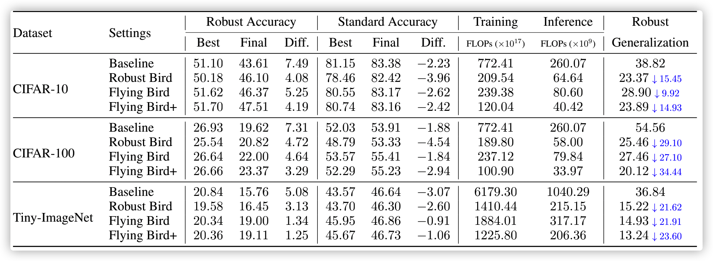

# Sparsity Winning Twice: Better Robust Generalization from More Efficient Training

[](https://opensource.org/licenses/MIT)

Code for the paper: [ICLR 2022] [Sparsity Winning Twice: Better Robust Generalization From More Efficient Training](https://openreview.net/forum?id=SYuJXrXq8tw)

Tianlong Chen\*, Zhenyu Zhang\*, Pengjun Wang\*, Santosh Balachandra\*, Haoyu Ma\*, Zehao Wang, Zhangyang Wang

## Overview
In this paper, we investigate the problem of robust generalization from a new perspective, i.e., injecting appropriate forms of sparsity during adversarial training. Specifically:

- **Static Sparsity**, which leverages recent results from the lottery ticket hypothesis to identify critical sparse sub-networks arising from the early training. And we propose Robust Bird (**RB**) that locates the critical sparse structures using only the cheapest standard training.
- **Dynamic Sparsity**, which allows the sparse subnetwork to adaptively adjust its connectivity pattern. We propose Flying Bird (**FB**) based on dynamic sparsity, while sticking to the consistent sparstiy level. And we further enhance FB to adaptively adjust the sparsity levels according to training statistics, which we called Flying Bird+ (**FB+**).

Extensive experiments validate our proposals with multiple network architectures on diverse datasets, including CIFAR-10/100 and Tiny-ImageNet.

## Experiment Results
Performance showing the effectiveness of our proposed approaches across different datasets with ResNet-18. The subnetworks at 80% sparsity are selected here.



## Prerequisites

- pytorch 1.5.1
- torchvision 0.6.1 
- advertorch 0.2.3

## Usage

**Dense:**

```shell
python -u main_adv.py \
	--data [data/cifar10] \ 
	--dataset cifar10 \
	--arch resnet18 \
	--save_dir [experiment/dense] 
```

**Robust Bird:**

```shell
cd Robust-Bird
python train_eb.py \
	--stage1 sgd \
	--epochs1 200 \
	--stage2 pgd \
	--epochs2 200 \
	--arch resnet18 \
	--data data/cifar10 \
	--pruning unstructured \
	--density 0.2 \
	--save_dir [experiment/rb]
```

**Flying Bird :**

```shell
python -u main_adv.py \
	--data [data/cifar10] \ 
	--dataset cifar10 \
	--arch resnet18 \
	--save_dir [experiment/fb] \
	--density 0.2 \
	--dynamic_fre \
	--fb
```

**Flying Bird+:**

```shell
python -u main_adv.py \
	--data [data/cifar10] \ 
	--dataset cifar10 \
	--arch resnet18 \
	--save_dir [experiment/fb+] \
	--density 0.2 \
	--dynamic_fre \
	--fbp
```


## Citation

```
TBD
```
